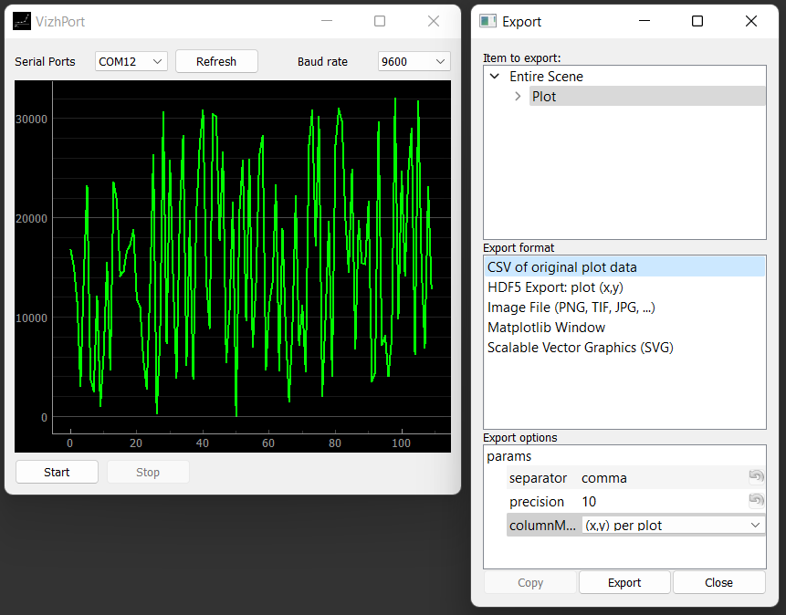
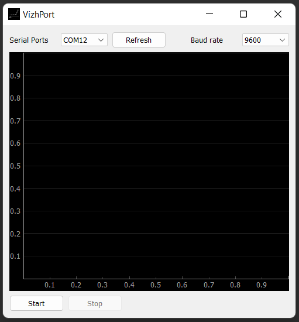

<p align="center">
    
</p>

# VizhPort

VizhPort is a Python program that allows users to monitor the serial port with a graphical display using Pygtgraph. It provides a wide selection of baud rates and available ports, giving users flexibility in connecting and monitoring their devices. The program utilizes Pygtgraph's rich features to enable users to customize their display according to their requirements.

## Features

VizhPort offers the following features to enhance the monitoring experience:

- Real-time monitoring of the serial port with a customizable display.
- Supports a wide range of baud rates for compatibility with various devices.
- Allows users to choose from available ports for seamless connection.
- Customizable graph display options using the pygtgraph library.
- Adjust visible X and Y axes to focus on specific data ranges.
- Transform the data for different perspectives.
- Downsample data for improved performance with large datasets.
- Import recorded data from CSV files for analysis or further processing.
- Export data as image files (PNG, JPG, or SVG) for sharing or documentation.
- Visualize data in a matplotlib window for more advanced plotting capabilities.

## Installation

To use VizhPort, follow these steps:

1. Clone the repository and install the required Python modules to your local machine using the following command.
    ```batch
    git clone https://github.com/nthnn/VizhPort.git
    cd VizhPort
    scripts/module_installer.bat
    ```

2. After successful cloning of repository and installation of required modules, the "__main__.pyw" can now be run. Or you can also run the "build_installer.bat" to build a launcher with [PyInstaller](https://pyinstaller.org/).

## Usage

Upon launching VizhPort, you will be presented with a user-friendly interface to monitor the serial port data.

1. Use the dropdown menus to select the desired baud rate and available serial port.
2. If there are expected changes on the serial communication ports, click the refresh button.
3. Utilize the transformation options to manipulate the displayed data according to your requirements by right clicking the line graph.
4. The buttons start or stop are at the bottom of the window, these button are used for visualizing the integral data from the selected serial communication port. The recorded data can be exported in various formats, by right clicking on the line graph.

## Screenshots

VizhPort demonstration with the export tool window.

<p align="center">
    
</p>

VizhPort on launch.

<p align="center">
    
</p>

## License

Copyright 2023 - Nathanne Isip

Permission is hereby granted, free of charge, to any person obtaining a copy of this software and associated documentation files (the “Software”), to deal in the Software without restriction, including without limitation the rights to use, copy, modify, merge, publish, distribute, sublicense, and/or sell copies of the Software, and to permit persons to whom the Software is furnished to do so, subject to the following conditions:

The above copyright notice and this permission notice shall be included in all copies or substantial portions of the Software.

```THE SOFTWARE IS PROVIDED “AS IS”, WITHOUT WARRANTY OF ANY KIND, EXPRESS OR IMPLIED, INCLUDING BUT NOT LIMITED TO THE WARRANTIES OF MERCHANTABILITY, FITNESS FOR A PARTICULAR PURPOSE AND NONINFRINGEMENT. IN NO EVENT SHALL THE AUTHORS OR COPYRIGHT HOLDERS BE LIABLE FOR ANY CLAIM, DAMAGES OR OTHER LIABILITY, WHETHER IN AN ACTION OF CONTRACT, TORT OR OTHERWISE, ARISING FROM, OUT OF OR IN CONNECTION WITH THE SOFTWARE OR THE USE OR OTHER DEALINGS IN THE SOFTWARE.```